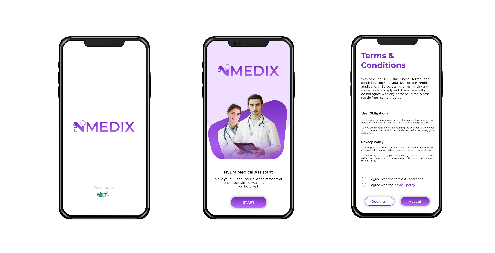
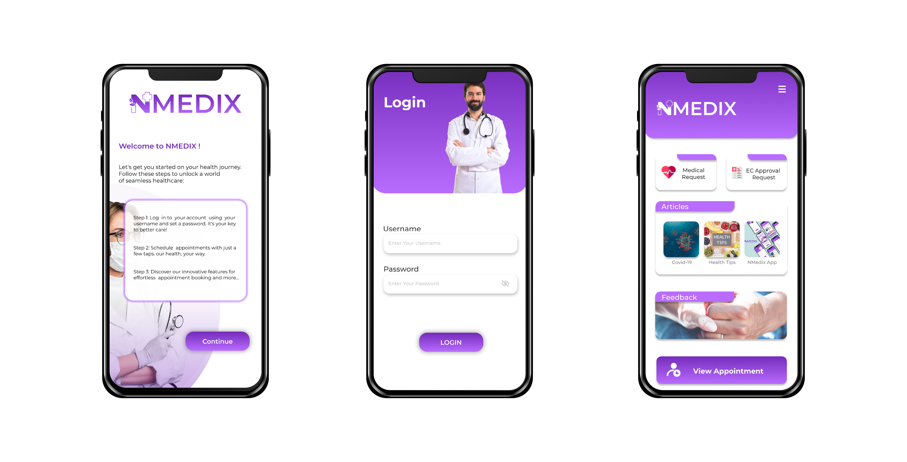
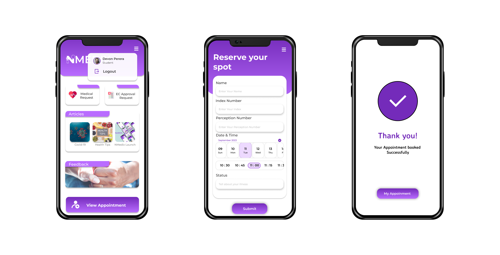
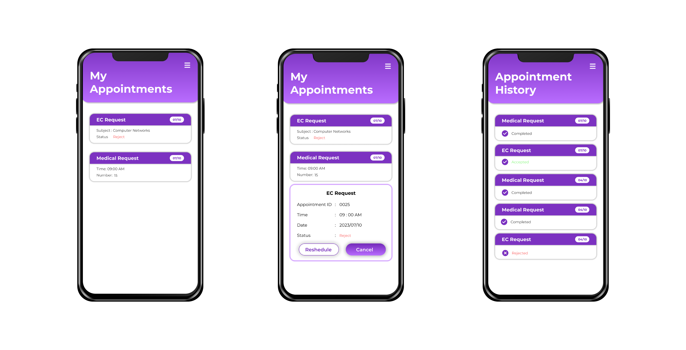
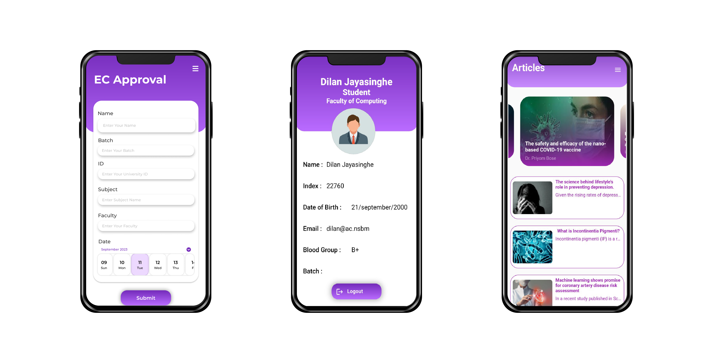
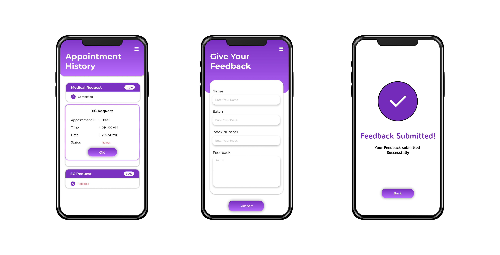

# NMEDIX Mobile Applicattion

#  

 

## Introduction
NSBM Green University prioritizes health care for staff and students, offering personalized medical advice and treatments to address individual medical needs in a fast-paced society, addressing the challenges posed by environmental pollution and hectic schedules.
In light of all the issues, user demands, and expectations, we advise the medical facility to adopt the mobile application NMEDIX. This mobile application makes it easier for medical facilities to complete their jobs quickly and effectively.

## UI and Introduction
 

>SPLASH PAGE
The splash page UI for the NMedix platform serves as an interesting and educational introduction to the platform. It offers a favorable first impression by extending a warm welcome to consumers with an aesthetically pleasing layout and inspiring graphics.

>GET STARTED
Utilizing the "Get Started" page interface, users can explore NMedix's platform with ease. It highlights the neatness, personalised healthcare options, and ease of use of NMedix.

>TERMS AND CONDITIONS
Our user-friendly interface for our Terms & Conditions ensures transparency and clarity, allowing users to easily understand and accept our policies, ensuring they can easily navigate and comprehend our commitments.

 

 

 

 
